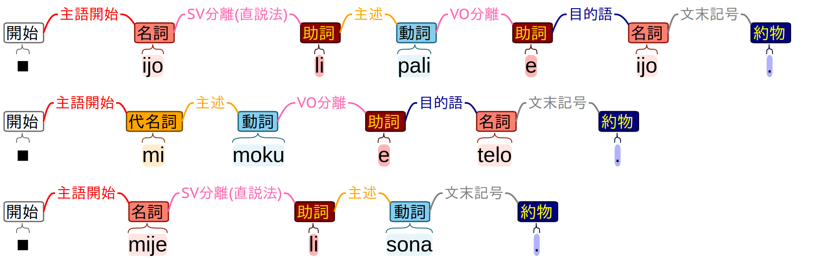
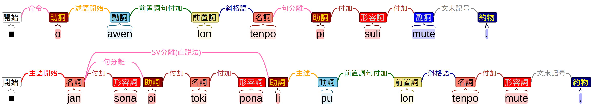
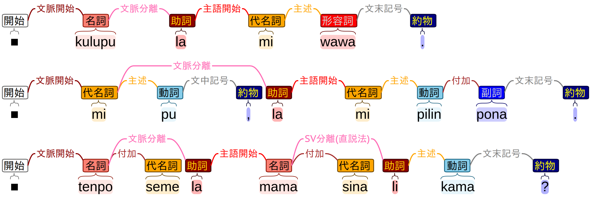

この記事は「語学・言語学・言語創作 Advent Calendar 2022」の２日目かもしれません．

# jan Sonja も知らないトキポナ文法

puです．

## はじめに

人工言語トキポナってのがあります．単語が120ぐらいしかなくて，文法もかんたんなので，考えていることをそのまま伝えられるという強い思想のもとに作られた言語です．jan Sonjaって人が作りました．

それで，人は，トキポナを勉強するぞ〜って思うわけで，作者が書いたトキポナ教本，通称 "pu" を買って読んだりするわけです．しかし，pu の説明が割といい加減なので，細かいところが理解できないままになってしまうということが多いような気がしています．

私はトキポナを勉強し始めて３年は経っていて，人生の貴重な時間のかなりの部分をトキポナ研究に費やしてきました．それで，最近わかってきたこととして，jan Sonja はトキポナを独自感性で理解している可能性が高そうです．このせいで，pu の説明に行間が生まれ，どうしても理解しづらいものになってしまっています．

実際にはトキポナはすごくかんたんです．そのへんの人が３年ぐらい考えただけで完全に理解できるので，本当にかんたんです．かんたんな言語で人々がコミュニケーションをとることで，人類の相互理解が進み，世界から紛争や貧困がなくなることは説明するまでもなく明らかです．トキポナを広め，全人類がトキポナで会話し，真に安定と平和を享受することができる新世界秩序を構築するためにも，トキポナを誰でも理解できるような形まで落とし込み，その文法を表現し伝えることは一切の疑念の余地のない人類的急務です．

この記事では，トキポナ文の単語間に，その関係性を図示し，文がどのような構文であるかを記述することで，視覚的にトキポナ文法を表現する方法を提案します．

以下，いろいろ説明がされていますが，トキポナ自体の説明というよりは，トキポナ文法を表現する方法の説明になっているので，トキポナなんもわからんという状態で読もうとしてもよくわからないかもしれません．なんかあんまり気力がなく，丁寧に説明を書けてないところもあるので，なんとなくそれっぽいなぐらいに思えたらいいんじゃないかという気がします．

以下の説明で出てくる方法で図示した pu に出てくる300文は，こちらから見れます．さっき(11/29)徹夜して作ったので間違ってるところもあるかもしれませんが，どうぞ:
https://github.com/nymwa/sonja_mo_shiranai/pu.svg

## 単語の品詞の種類

単語にはいろいろな役割があり，その区分けは品詞と呼ばれます．以下に，品詞の一覧を載せます．

| 品詞 | なにそれ |
| --- | --- | 
| 名詞 | 名詞です |
| 代名詞 | mi, sina, ona, seme です |
| 限定詞 | ni です |
| 固有名詞 | Nijon とかみたいな名前のことです |
| 動詞 | 動詞です |
| 助動詞 | 動詞に話者の意図を乗せます |
| 形容詞 | 名詞を修飾します |
| 副詞 | 動詞を修飾します |
| 数詞 | 数字です |
| 前置詞 | 前置詞 + 名詞句で動詞にかかる感じ |
| 接続詞 | anu, en, taso です |
| 感動詞 | a です |
| 助詞 | その他の機能語です |
| 約物 | .,!?:とかみたいな記号 |

ほとんどの品詞は名前の付け方に疑問がないと思います．ただ，助詞だけは日本語のそれと違っています．これは，pu で "particle" と呼ばれているもので，小辞などと訳されることもありますが，他の品詞に合わせて「詞」で終わるようにする場合，助詞が適切だと思っています．

品詞を図示するときは，次のような色で表します．

## トキポナ文の始まり方

トキポナには，**主語がある文**と**主語がない文**があります．主語がある文は，次のような形式を取ります：

- 主語 + 述語

一方で，主語がない文は，述語のみからなります．

- 述語

「主語 + 述語」の形の文ように，文が主語から始まることを，**主語開始**と呼びます．「述語」の形の文は，文が述語から始まっていますが，これを，**述語開始**と呼びます．述語開始の例として，命令文，疑問文に対する返答，定型文などがあります．後で説明します．

また，トキポナでは，主語開始文・述語開始文の先頭に文脈句をつなげることができます．文脈句をつなげた文は，文脈句から始まり，これを，**文脈開始**と呼びます．文脈句は必ず次の形でつなげられます：

- 文脈句 + 助詞 la + 主語開始文 または 述語開始文

さらに，トキポナには呼格があり，これは主語開始文の先頭につなげ，呼びかけを表します．これは，**呼格開始**と呼び，次の形になります：

- 呼格句 + 助詞 o + 主語開始文

トキポナの文の始まり方は，概ねこれらで説明できます．

## 主語述語の関係

「主語 + 述語」の文のもっともかんたんな形は「主語 + li + 述語」の文です．文がどのように始まるかを明示するため，文頭に開始記号を入れています．主語開始の文なので，開始記号から先頭の単語には，単語間の関係性として，主語開始を付与します．このような単語間の関係性を，**関係**と呼びます．

主語と述語を分離する助詞の li は，「SV分離」と表示されます．主述を分離する助詞は，li と o です．li は直説法で，o は命令法です．

文末記号の関係は，文中のどこにつけても問題なさそうですが，どこでもいいので左となりの単語につなげています．

mi や sina の主語で始まる文は，その直後に述語が始まるので，SV分離の表示がありません．

## 付加

トキポナでは，修飾関係は日本語とは逆で，後ろの単語が前の単語にかかります．前の単語が後ろの単語を支配するという言い方もできます．今回は，このような関係を付加の関係と呼ぶことにします．

## 関係について

今回のトキポナ文法では，いろんな関係が出てきます．各関係について説明する前に，関係が満たしている条件について理解しておいてほしいです．

知っておいてほしいこと:
 - どの単語からも，開始記号まで右から左に関係をたどるだけで移動できます．

下の図などで確かめてもらいたいです．

これは非常に重要な事実です．言い換えると，左から右に進んでいくとどこか文の途中で行き止まりになることがあるけど，右から左に進む場合は必ず先頭までたどり着けるということです．トキポナの文は必ずこの方法で表現できるのですが，トキポナの文は，句をどんどん右に展開していき，枝分かれしていくような構造をとっているということを意味します．

## 動詞

目的語がない場合，動詞述語の文は今まで出てきた例と同じ構造になります．

トキポナで他動詞が目的語を取る場合は，「主語 li 動詞 e 目的語」の形を取ります．e は動詞と目的語を分離する働きがあるので，VO分離の関係を持ち，e と目的語の間には目的語の関係が付与されます．

ここまで紹介した関係だけで，結構な量のトキポナ文の構造を説明できます．

よくある英語の構文木みたいなのを使うと，本来かんたんなはずのトキポナを不当に複雑に表現することになってしまいますが，左から右に分岐していく方式だと，かなりかんたんに記述できることが実感できるかもしれません．

# seme

疑問代名詞 seme を使った疑問文は，基本的にはいままでと同じような構造になります．seme が主語になる場合は主語としての関係を持ちますし，修飾語になる場合は，付加の関係を持ちます．

anu seme に関しては，接続詞 anu が，その前後で「等位(左)」，「等位(右)」の関係を持ちます．等位(左)がかかる先は，seme と等しい関係になっている句の先頭になります．この場合は述語にかかっています．

# 反復疑問

トキポナでは，「X ala X」の形で述語の先頭の単語を反復することで疑問文を作ることができます．この際，ala は否定の意味合いを持たないため，形容詞・副詞とはならず，文法的な意味を表している助詞として，反復の前後を分離する働きをしています．反復疑問の ala は等位接続の関係で表されます．

疑問文に対する返答として，述語をそのまま言い返すことがあります．この場合，これは述語開始の文になるので，述語開始の関係を用いて表されます．ala を用いた返答も，述語の ala の部分のみを取り出してきたとみなし，述語開始で表します．感動詞 ala と捉えることも可能だとおもいます．

# 前置詞

トキポナでは，前置詞句は，原則，述語が支配します．この関係は，述語の先頭の語と前置詞との間の前置詞句付加として表されます．前置詞とその対象になる語の関係は，斜格語として表されます．

前置詞句をたくさん並べると，前置詞句付加の関係がたくさん重なっていきます．

# 固有名詞

トキポナでは，ほとんどの場合，固有名詞は「名詞句 + 固有名詞」の形で出てきます．この場合，固有名詞は名詞句を定義する同格の用法なので，同格の関係で表されます．また，"nimi mi li Apu." の例のように，固有名詞が単独で述語となることもあります．

ちなみに，pu の "Epawan Linkan"のところは，"Epawa**m** Linkan"と間違っていることが有名です．

# 感動詞

感動詞が単独で用いられる場合，どこにもかかることなく，単独で文を構成することを意味する関係である，自立感動を表示します．

文中で用いられて，強意などの意味を持つときは，付加感動で表します．述語にかかっている場合は，述語の戦闘にかかります．

a a a!

この場合，自立感動の連接と捉えてもいいし，2つ目以降は付加感動と捉えてもよくて，どっちがいいのかとかはよくわかりませんが，どっちでもいいし，なんとなく付加感動にしました．

## あいさつ

トキポナでは，挨拶などの定型文は述語開始になることがあります．たとえば，"kama pona!" 「ようこそ」や，"tawa pona!" 「さようなら」などです．これは，定型文なので覚えるしかないのですが，主語を省略した述語開始の文だと捉えることができます．

## o, 命令と呼格

トキポナの命令は，「o + 述語」です．そのため，命令文は述語開始です．"o" 自体は述語を構成するために必ず必要なものではないはずで，定型的な述語開始文では不要です．ただ，そうでない場合，非文になってしまうのでつけます．この "o" は，命令の関係で文を開始することになりますが，その直後に述語が始まるときに述語開始の関係を付与します．

また，"o" を命令ではなく，呼びかけを表す働きもあります．「呼びかけの対象 + o + 主語開始文」とすることで，呼びかけの文を作ることができます．この場合，呼びかけの部分は，呼格開始の関係で開始記号と結ばれ，助詞 o に対しては，呼格終了で関係付けられます．その後に，主語開始の関係で，文が始まります．

呼びかけの場合，「jan Nima o, ~」みたいにカンマで区切ることが多いですが，このカンマは文中記号の関係で直前の句と関係付けることにしています．これは別にあってもなくてもいいような話です．

主語を明示する命令，「主語 + o + 述語」も可能です．これは，直説法のSV分離助詞 li を 命令法のSV分離助詞 o に変えたものと解釈できます．そのため，主語と o の間には，命令法のSV分離の関係が張られます．

## pi

pi は複数の句を結びつける助詞です．トキポナでは，付加語をたくさん並べると，後側の語はなるべく前の語に付加します．これでは，連接する複数の語がひとまとまりの意味を持ってしまい，複雑な表現はできないので，pi を使って，複数のまとまりの間の関係性を表せるようにしています．

piが句を分離する働きは，句分離の関係で表されます．pi の後側の句は前側の句に付加するのですが，pi を介して付加するため，それは，pi に付加することで表されます．

## 助動詞

助動詞は述語について，話者の意図を表します．これは，pu に出てくる，ken, kama, wile, sona, awen, lukin などの助動詞は話者の意図，モダリティーを表すものになっているため，そう言えるのですが，pini, open などの pu 以降に出現した助動詞の用法にはそうでないものもあります．

助動詞は，述語について新しい述語を作ることができます．そのため，助動詞は主語と結びついて，主述の関係を持ちます．ただ，助動詞は単独では述語を作ることができず，その後ろに続く，単独で述語を構成できる部分は，助動詞に欠如している部分を補完する役割であると言えます．そのため，この部分の関係は補完と呼びます．

助動詞を用いた否定文，疑問文でも同じです．

## 文脈の la

助詞 la は文脈を表します．文脈・コンテキストは，文と文の関係性のことを言ったり，話者の意図，話者の意図にそって前置詞句を移動し，強調することを指します．「語・句・文 la 文」の形で用いられます．
 - 「副詞 + la + 文」による定型表現
 - 「前置詞句 + la + 文」による，前置詞を文頭に移動した表現
 - 「文1 + la + 文2」による，「文1ならば，文2」の表現

「副詞 + la + 文」は，"ken la ~" 「おそらく」や，"lon la ~" 「たしかに」などの定型表現に用いられます．

「前置詞句 + la + 文」は，文の述語にかかる前置詞句を文頭に移動させるものです．ただし，lon が作る前置詞句を文頭に移動させる場合，lon が脱落することになっています．例えば，"kulupu la mi wawa."は，"mi wawa lon kulupu."と文意は同じです．

文脈部分と開始記号との関係は，文脈開始としています．la は文脈を主文と分離するものなので，la 自体は文脈分離の関係で文脈部分と関係付けられ，後ろに続く主文とは，主語開始や命令といったような関係で結び付けられます．

## taso, en

taso や en は接続詞です．なにかとなにかを接続するものです．en は anu と同じで，等位関係で表されます．taso は，文と文の関係を表すものです．ただ，今回の方法では，文を超える関係性は表せないので，taso から左側に等位の関係を表示します．

## 色

色を表す単語は，一般の単語の付加関係よりも優先的に結びつきます．"loje laso"のように，色を表す単語を優先的に結びつける関係が，色合成です．

## 数

トキポナの記数法は，加算によって大きな数を表します．

加算は，色合成と同様に，付加よりも優先的な関係なので，独自の関係で表されます．加算関係にある数をすべて足した数が，その句が意味する数になります．

序数は，"nanpa 数" の形で表されます．序数そのものが述語になる場合は，名詞 nanpa が述語になり，その後ろに序数の関係で結び付けられた数が来ます．一方，序数が付加する場合，nanpa は普通の名詞と同様の付加をすることができず，助詞として，前の句と後ろの数の句を分離する働きをします．この働きは，pi の句分離と同様であり，序数分離と呼んでいます．

自分は，nanpa を助詞と捉えています．一方，前置詞と捉える人もいます．これには，la による文頭への移動ができないという矛盾もありますが，可能な解釈のひとつです．

## 最後に

これで，一応トキポナ文法を表現するための関係に関する説明は終わりです．正直，説明の仕方にかなり問題もあるという気もしていますが，トキポナの構造を可視化し，その文法を視覚的に示す方法としては，トキポナのかんたんさを，かんたんなまま表すことができるという点で，非常に良いものになっていると思っています．

もともとは，アドベントカレンダーで，「トキポナを完全に理解する計算機システムを作ろう！　第１回　単語の役割がわかるシステムを作ろう！」と，つづきとして「第２回　文の構造がわかるシステムを作ろう！」というのをやろうとしていました．ただ，やることがとても多いので，時間的に厳しかったです．内容としては，今回説明したトキポナの表現方法を機械的に自動で予測する手法の説明をするものでした．これについては，また別の機会に扱います．

このように，文の構造を可視化するような方法には，構文木や係り受け解析など，様々なものがあります．いずれも，結構複雑な構造になりがちで，トキポナの文法を表現するには，すこし冗長なものであるように感じていました．今回の方法は，実は係り受け解析の方法と非常に似ていて，かなり影響を受けています．ただ，係り受け解析は，係り受けの矢印が左右にたくさん飛んでいて，その柔軟性のせいでどうしてもトキポナを簡潔に表せないような気がしていました．ただ，ある日，「矢を右から左にたどっていったとき，必ず先頭にたどり着くような制約を入れれば，かんたんに表せるのではないか？」みたいな着想を得て，色々考えた結果，このような形に落ち着きました．既存の表現方法をそのまま使うことが必ずしも常に良いというわけではないのかもしれません．

実は，「トキポナを完全に理解する計算機システムを作ろう！」は，第１回・第２回だけでなく，その先も想定しています．第３回として「文脈がわかるシステムを作ろう！」というのを考えています．今回紹介した方法は，文の内部の関係性や構造を表しただけでした．ただ，固有表現や代名詞の照応関係，談話構造など，文脈解析という先の課題もまだ残っています．トキポナに関する数々の課題を解決し，より深く理解するために，これからもいろいろやっていきたいと思います．

≡╹ω╹≡ おしまい ≡╹ω╹≡

